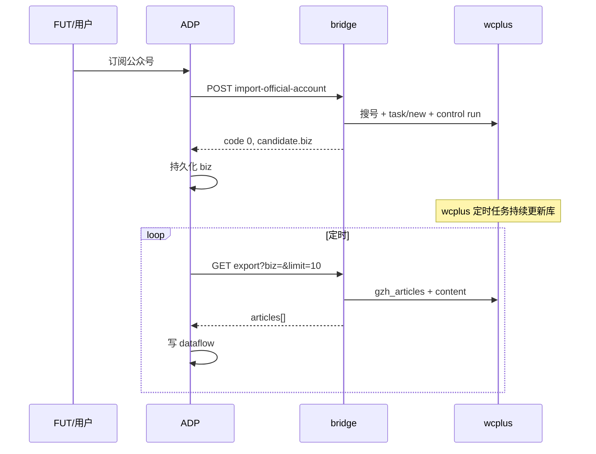
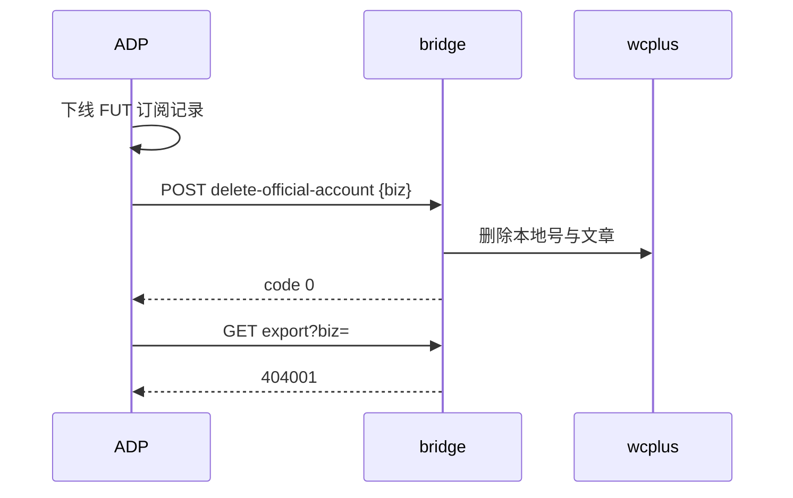

# wcplus bridge — 对接集成手册

**读者**：ADP、FUT、网关与联调同学。  
**目标**：说明每个 HTTP 接口**做什么**、**内部怎么做**、**请求/响应参数**，便于一次性完成对接。  
**版本**：与当前 `cmd/bridge` 契约一致（含 `delete-official-account`）。

---

## 0. 产品交付范围（就这些）

与架构图红框 +「异常状态」三条 + **删除公众号** 对齐；**除此以外 bridge 上的运维 RPC 可不对 ADP 暴露**。

| 产品要求 | bridge 怎么做 | 对接用哪个接口 |
|----------|---------------|----------------|
| **通过公众号链接导入** | 解析 `articleLink`（或昵称/biz），在 wcplus 建号并建链接任务 | `POST /v1/rpc/import-official-account` |
| **公众文章仓库**（proxy 或自存） | 当前实现 = **proxy**：只读 wcplus 已入库数据，bridge **不自建库** | `GET /v1/rpc/export-latest-articles?limit=10` |
| **检测微信是否被登出** | 无微信 push；轮询 `req_data` + import/export 前校验；watchdog 检测「曾就绪→未就绪」 | `GET /v1/rpc/status` + 配置 `callback` / `watchdog` |
| **通知人工干预或其他方案** | HTTP **503001** + 出站 POST `collector.not_ready` / `collector.manual_required` 等 | ADP 提供 `callback.base_url`（见 §5） |
| **异常 1：号未添加 → 不存在** | biz 不在 wcplus 列表 | export → **404** `404001` |
| **异常 2：否则最新 10 篇** | 在库则 200，`articles[]` 最多 10 条；无文 = 空数组 | export 默认 `limit=10` |
| **异常 3：微信/采集整体是否正常** | `ok` / `wechatReady` / `message` | `GET /v1/rpc/status` |
| **删除公众号**（补充需求） | 调 wcplus 删本地号与文章 | `POST /v1/rpc/delete-official-account` |

**不在你交付范围内的（wcplus 侧，图下说明）：**

- **主程序 + 定时任务**：全部由 **wcplusPro** 提供；采集机里配好定时即可，**bridge 不写定时抓取**。

**ADP 最小必接 4 个 RPC + 1 个被动 URL：**

```text
POST import-official-account
POST delete-official-account
GET  export-latest-articles?biz=&limit=10
GET  status
POST <ADP 提供的 callback URL>   ← bridge 出站，不是 bridge 上的 path
```

详细参数见下文 §4；错误码见 [error-codes.md](./error-codes.md)。

相关文档：

| 文档 | 用途 |
|------|------|
| [error-codes.md](./error-codes.md) | 错误码与 FUT 映射、503002 详情 |
| [adp-scope.md](./adp-scope.md) | ADP 红框范围与运维清单 |
| [bridge-api-guide.md](./bridge-api-guide.md) | 更长示例、cURL、运维章节 |
| [project-overview.md](./project-overview.md) | 代码目录与 wcplus API 映射表 |

---

## 1. 项目是什么

**wcplus bridge** 是与 **wcplusPro Max** 同机运行的 HTTP 边车（默认 `http://127.0.0.1:19090`）。  
ADP/FUT **只调 bridge**，不直连 wcplus（`http://127.0.0.1:5001`）。

bridge **不存业务库**：文章数据在 wcplus 本地库；bridge 负责鉴权、错误码、编排 wcplus API、可选回调 ADP。

```text
┌─────────┐   HTTP RPC    ┌──────────────┐   HTTP      ┌─────────────┐
│ ADP/FUT │ ────────────► │ wcplus bridge│ ──────────► │ wcplusPro   │
│         │ ◄──────────── │   :19090     │ ◄────────── │ Max :5001   │
└─────────┘  code/data    └──────────────┘             └─────────────┘
      ▲                           │
      │    callback POST          │ 定时抓取在 wcplus 内配置，不在 bridge
      └───────────────────────────┘
```

### 1.1 分工（对接时必须清楚）

| 系统 | 负责什么 | 不负责什么 |
|------|----------|------------|
| **ADP** | 存订阅 **biz**；定时 export → dataflow；提供 callback URL；批量 import = 循环单号 | 不直连微信；不在 ADP 重算采集 |
| **bridge** | import / delete / export / status；404/409/503/502；出站通知 | 不替代 wcplus 定时任务；不存文章仓库 |
| **wcplus** | 微信采集、本地 SQLite/文件库、Max 授权、**自带定时更新** | 不对 ADP 暴露稳定契约（由 bridge 封装） |

**biz**：微信 `__biz` 参数（Base64），import 成功后 ADP **必须持久化**；FUT 列表里的 `id` 即 biz。

---

## 2. 接入前置

1. 采集机已安装 **wcplusPro Max** 且授权有效（`5001` 可访问）。
2. 已部署 **bridge.exe**（或 `go run ./cmd/bridge`），`configs/config.yaml` 中 `wcplus.base_url` 指向本机 wcplus。
3. ADP 能访问 bridge 地址（同机 `127.0.0.1` 或 VPN/隧道 + **强 `auth_token`**）。
4. wcplus 内已配置**定时抓取**（新号 import 后由 wcplus 持续更新；bridge export 只读已有数据）。
5. （推荐）配置 `callback.base_url` 为 ADP 通知接收 URL；`watchdog.enabled: true`。

---

## 3. 通用约定

### 3.1 基址与鉴权

| 项 | 说明 |
|----|------|
| Base URL | 例：`http://127.0.0.1:19090` |
| 鉴权 | 若配置了 `auth_token`，所有路由（含 `/health` 以外 RPC）需：`Authorization: Bearer <token>` |
| Content-Type | POST  body：`application/json` |

### 3.2 响应格式

**成功**（`/health` 除外）：

```json
{ "code": 0, "data": { } }
```

**失败**：

```json
{ "code": 404001, "error": "公众号不存在", "biz": "Mz..." }
```

HTTP 状态与 `code` 同时存在（如 404 + `404001`）。完整表见 [error-codes.md](./error-codes.md)。

### 3.3 超时建议

| 接口 | 建议超时 |
|------|----------|
| `export-latest-articles`（默认带正文） | **≥ 120s** |
| `import-official-account` | ≥ 120s |
| `status` / `delete` | 30s |
| ADP callback 接收 | 快速 2xx（bridge 不等待业务处理完成） |

### 3.4 ADP 主路径 vs 运维路径

| 标记 | 接口 |
|------|------|
| **ADP 日常必接** | import、delete、export、status |
| **运维 / 异常** | login/prepare、login/finish、login-status、initialize、sync、remediate |
| **探测** | `/health` |

---

## 4. ADP 必接接口（详细）

### 4.1 导入公众号

**做什么**  
把目标公众号加入 wcplus 本地库，并（默认）创建「文章链接」采集任务且启动队列。ADP 拿到 **biz** 后写入订阅表。

**怎么做的（bridge 内部）**

1. 检查采集机就绪（**仅 import**）：wcplus 可达、Max、`req_data`；否则 **503001**。**export 不检查**，无文返回 **200+`[]`**。
2. 按入参分支：
   - **articleLink**：调 wcplus 文章链接导入 API（多路径尝试，与 UI「通过文章链接导入」一致）。
   - **nickname / biz / link**：在 wcplus 已入库列表或候选搜索中解析候选号；若已存在 → **409001**。
3. 检查同一 `biz` 是否已有未完成的 `gzh_article_link` 任务；有则复用，避免重试再建任务。
4. 无可复用任务时，`POST /api/task/new`，`crawlerType=gzh_article_link`，创建链接任务。
5. 若 `runQueue` 省略或为 `true`：`POST /api/task/control` `command=run`；显式为 `false` 时不启动队列。
6. 成功可选 callback：`import.succeeded`（仅 `notify_mode=all`）。

**请求**

```http
POST /v1/rpc/import-official-account
```

| 字段 | 类型 | 必填 | 默认 | 说明 |
|------|------|------|------|------|
| `articleLink` | string | 三选一 | — | `https://mp.weixin.qq.com/s/...` |
| `nickname` | string | 三选一 | — | 精确昵称（与 wcplus 搜号规则一致） |
| `biz` | string | 三选一 | — | 已知 biz |
| `link` | string | 可选 | — | 带 `__biz` 的公众号主页 URL |
| `runQueue` | bool | 否 | `true` | 省略时建任务后立刻 `task/control run`；显式 `false` 时仅建或复用任务，供调用方自行安排启动时间 |

**成功 `data`（ADP 关注字段）**

| 字段 | 说明 |
|------|------|
| `data.candidate.biz` | **必须存库** |
| `data.candidate.nickname` | 展示用 |
| `data.linkTask` | 任务创建结果（可忽略） |
| `data.taskReused` | `true` 表示复用了同一 `biz` 的未完成链接任务 |
| `data.queueStart` | 队列启动结果（可忽略） |

**常见错误**

| code | 含义 | ADP 处理 |
|------|------|----------|
| 409001 | 已在 wcplus | 当成功，继续用该 biz |
| 503001 | 采集机未就绪 | 暂停 **import**，提示运维；export 改用 status 看整体状态 |
| 502001 | wcplus/搜号失败 | 重试、看采集机日志 |
| 100001 | 参数错误 | 修 JSON |

**批量**：无批量 RPC；ADP 对多个链接/昵称 **for 循环** 调本接口。

---

### 4.2 删除公众号

**做什么**  
从 **wcplus 本地** 删除该 biz 对应公众号及其文章数据（等同 wcplus UI 删除图标）。**不**删 ADP/FUT 订阅记录，由 ADP 自行维护。

**怎么做的（bridge 内部）**

1. 分页扫描 `GET /api/gzh/list`，确认 biz 已入库；不存在 → **404001**。
2. 调 wcplus 删除 API（公开文档未列；bridge 依次尝试 `/api/gzh/delete`、`remove`、`del` 等；失败 → **502001**）。
3. 清除 bridge 内 biz 查找缓存。
4. 成功可选 callback：`delete.succeeded`（`notify_mode=all`）。

**请求**

```http
POST /v1/rpc/delete-official-account
```

| 字段 | 类型 | 必填 | 说明 |
|------|------|------|------|
| `biz` | string | **是** | 与 import 保存的一致 |
| `nickname` | string | 否 | 缺省时从 wcplus 列表补全，供 wcplus 删除 API 使用 |

**成功 `data`**

```json
{ "biz": "Mzxxxx==", "nickname": "公众号名" }
```

**常见错误**

| code | 含义 |
|------|------|
| 404001 | wcplus 无此 biz |
| 502001 | wcplus 删除路径不匹配或失败（Windows F12 点一次「删除」核对真实 POST） |

删除后同一 biz 再 export → **404001**；需要时可重新 import。

---

### 4.3 导出最新文章

**做什么**  
按 **biz** 读取 wcplus 已入库文章中**最新 N 条**（默认 10），可选拉取 HTML 正文，供 ADP 写 dataflow。

**怎么做的（bridge 内部）**

1. **不**做 import 同款采集机就绪拦截（只读 wcplus 已入库数据）；整体是否正常请用 **`GET /status`**。
2. 确认 biz 在 wcplus 列表；否 → **404001**（**不是**空数组）。
3. `GET /api/report/gzh_articles`，按 `p_date desc` 取前 N 条。
4. 若 `withContent=true`（默认）：对每条 `GET /api/article/content` 拉正文。
5. 若需要正文但全部为空，或 wcplus 报受限 → **503002**（带部分 `data` 与 `remediation` 指引）。

**不触发重采**：只读库；新文章依赖 wcplus 定时/任务。

**请求**

```http
GET /v1/rpc/export-latest-articles?biz=Mzxxxx==&limit=10&withContent=true
```

| Query | 类型 | 必填 | 默认 | 说明 |
|-------|------|------|------|------|
| `biz` | string | **是** | — | ADP 存的 biz |
| `nickname` | string | 否 | — | 辅助拉正文（可与列表不一致时用） |
| `limit` | int | 否 | `10` | 1～100 |
| `withContent` | bool | 否 | `true` | `false` / `0` 不拉正文 |

**成功 `data`**

| 字段 | 说明 |
|------|------|
| `biz` | 请求的 biz |
| `officialAccountName` | 号名称 |
| `total` | wcplus 该号文章总数 |
| `articles[]` | 最多 `limit` 条 |

**`articles[]` 单条**

| 字段 | 说明 |
|------|------|
| `id` | 文章 ID |
| `name` | 标题 |
| `link` | 文章 URL |
| `time` | 发布时间 Unix **秒** |
| `imageUrl` | 封面 |
| `content` | 正文 HTML（`withContent=false` 时为空） |

**产品「异常状态」三条（必实现映射）**

| 情况 | bridge 行为 |
|------|-------------|
| 号未 import | **404** + `404001` |
| 号在库、暂无文 | **200** + `articles:[]` |
| 采集/微信通道异常 | **503** + `503001` 或 poll `status` 见下 |

---

### 4.4 采集机状态（status）

**做什么**  
给 FUT/ADP 状态灯用：当前能否正常 import/export（**不是** PC 微信是否登录 UI）。

**怎么做的（bridge 内部）**

1. `GET /api/gzh/list` 探 wcplus 可达 → `wcplusReachable`。
2. 读 Max 授权、`GET /api/req_data/get_gzh` → 判断 `needsManualLogin`。
3. `wechatReady = maxActive && !needsManualLogin`；`ok = wcplusReachable && wechatReady`。

**请求**

```http
GET /v1/rpc/status
```

**成功 `data`**

| 字段 | 类型 | 说明 |
|------|------|------|
| `ok` | bool | 可否服务 import/export |
| `wcplusReachable` | bool | wcplus HTTP 是否正常 |
| `maxActive` | bool | Max 是否激活 |
| `wechatReady` | bool | Max 且微信抓包参数就绪 |
| `message` | string | 如「正常」「微信参数未就绪…」 |

ADP 建议定时 poll（如 1～5 分钟）；`ok=false` 时暂停批量 export，并配合 callback。

---

## 5. ADP 被动接收：callback

bridge **不提供**「ADP 调 bridge 发通知」的入站接口。在 `callback.base_url` 配置 ADP 的 **POST 接收地址**。

**bridge → ADP  body 结构**

```json
{
  "type": "alert.triggered",
  "occurredAt": "2026-09-17T04:00:00Z",
  "payload": {
    "alertType": "collector.manual_required",
    "message": "…",
    "biz": "可选"
  }
}
```

`callback.notify_mode`：

| 值 | 行为 |
|----|------|
| `manual_intervention`（**推荐**） | 只推需人工处理：`collector.not_ready`、`collector.manual_required`、`login.still_required`、`wechat.content_restricted` |
| `all` | 另含 `import.succeeded`、`delete.succeeded`、`import_failed` 等 |

| type / alertType | 何时 |
|------------------|------|
| `alert.triggered` + `collector.not_ready` | **import** 返回 503001 |
| `alert.triggered` + `collector.manual_required` | watchdog：曾就绪→未就绪 |
| `alert.triggered` + `wechat.content_restricted` | export 503002 |
| `import.succeeded` / `delete.succeeded` | 成功（仅 `all`） |

ADP 必须 **快速返回 2xx**；失败不改变 RPC 结果。

---

## 6. 运维接口（摘要）

日常 dataflow **不必**调用；用于登录、补采、正文受限。

| 接口 | 做什么 | 关键参数 |
|------|--------|----------|
| `GET /health` | bridge + wcplus 连通 | 无 `code` 字段，`{"ok":true,"wcplus":"up"}` |
| `GET /v1/rpc/login-status` | Max、req_data、是否需手动开文 | 无 |
| `POST /v1/rpc/login/prepare` | wcplus Set Proxy | body 可为 `{}` |
| `POST /v1/rpc/login/finish` | Clear Proxy | 无 body |
| `POST /v1/rpc/initialize` | 返回授权与操作流程说明 JSON | 无 |
| `POST /v1/rpc/sync-official-account` | 按 steps 建 link/article/reading 任务，可选等队列、exportAfter | `biz`,`nickname`,`steps[]`,`waitQueue`,`exportAfter` |
| `POST /v1/rpc/remediate-wechat-content-restriction` | 503002 后 Set Proxy + 步骤说明 | `biz`,`articleURL` |

详细 cURL 见 [bridge-api-guide.md](./bridge-api-guide.md) §4.7～4.11。

---

## 7. 推荐对接时序

### 7.1 新订阅



### 7.2 取消订阅



### 7.3 异常

```text
export 404001     → ADP 触发 import 或提示用户
export 502/404/200+[] → 见 error-codes；采集机整体状态 poll **status**，不再靠 export 503001
export 503002     → 展示 remediation；可选 remediate + login/finish
import 409001     → 当成功，沿用已有 biz
status ok=false   → FUT 状态灯「需维护」
```

---

## 8. 联调检查清单

| # | 步骤 | 期望 |
|---|------|------|
| 1 | `GET /health` | `ok:true`, wcplus up |
| 2 | 未 import 的 biz 调 export | **404001** |
| 3 | import 新号 | **200**, 存 `candidate.biz` |
| 4 | 再 import 同号 | **409001** 或跳过 |
| 5 | export limit=10 | **200**；无文则 `articles:[]` |
| 6 | `GET status` | 字段齐全；掉线时 `ok:false` |
| 7 | delete 该 biz | **200**；再 export **404001** |
| 8 | ADP callback URL 收 POST | 2xx；manual 模式下 503 能收到 `collector.not_ready` |

---

## 9. 接口速查表

| 方法 | 路径 | ADP | 简述 |
|------|------|:---:|------|
| GET | `/health` | | 健康检查 |
| POST | `/v1/rpc/import-official-account` | ✅ | 入库 + 建任务 |
| POST | `/v1/rpc/delete-official-account` | ✅ | 删 wcplus 本地号 |
| GET | `/v1/rpc/export-latest-articles` | ✅ | 最新 N 篇 |
| GET | `/v1/rpc/status` | ✅ | 采集机是否可服务 |
| POST | `/v1/rpc/sync-official-account` | | 运维补采 |
| GET | `/v1/rpc/login-status` | | 运维详细登录态 |
| POST | `/v1/rpc/login/prepare` | | Set Proxy |
| POST | `/v1/rpc/login/finish` | | Clear Proxy |
| POST | `/v1/rpc/initialize` | | 初始化说明 |
| POST | `/v1/rpc/remediate-wechat-content-restriction` | | 正文受限指引 |

错误码速查：**0** 成功 · **100001** 参数 · **200001** 鉴权 · **404001** 不存在 · **409001** 已存在 · **503001** 未就绪 · **503002** 正文受限 · **502001/502002** wcplus/队列。

---

## 10. Windows 交付物

```bash
scripts/build-windows.sh
# → dist/wcplus-bridge/bridge.exe + config.yaml
```

采集机需同时运行 **wcplusPro** 与 **bridge.exe**；生产环境务必配置 `auth_token` 与 ADP `callback.base_url`。
